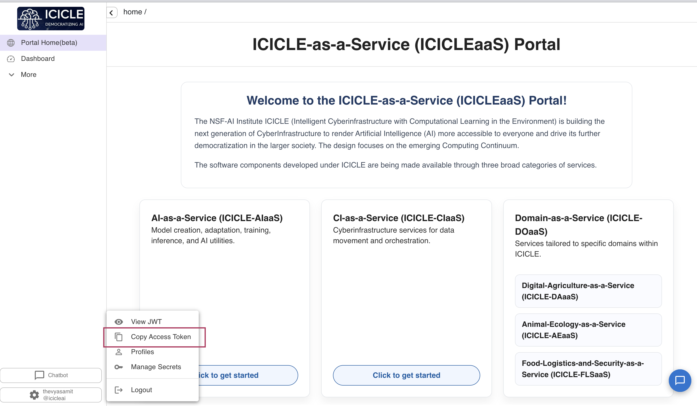

# ICICLE AI Vector Service

FastAPI + Qdrant vector storage and retrieval service for the **ICICLE AI** Tapis tenant. Clients provide their own pre-computed embeddings — the service handles storage, search, and reranking.

**Tags:** `AI4CI` `Software`

### License

[License: GPL v3](https://www.gnu.org/licenses/gpl-3.0)

This project is licensed under the GNU General Public License v3.0. See [LICENSE](LICENSE) for details.

## References

- [Qdrant Documentation](https://qdrant.tech/documentation/)
- [FastAPI Documentation](https://fastapi.tiangolo.com/)
- [Tapis Project](https://tapis-project.org/)
- [Diataxis Framework](https://diataxis.fr/)

## Acknowledgements

*National Science Foundation (NSF) funded AI institute for Intelligent Cyberinfrastructure with Computational Learning in the Environment (ICICLE) (OAC 2112606)*

## Issue Reporting

Please report issues via [GitHub Issues](https://github.com/ICICLE-ai/icicle-ai-vector-service/issues). Include steps to reproduce, expected behavior, and any relevant logs.

---

# Tutorials

## Quickstart

### Prerequisites

- Python 3.13+
- Docker (for local Qdrant)
- A valid ICICLE AI Tapis access token

### Step 1: Start Qdrant

```bash
docker run --name qdrant -p 6333:6333 -p 6334:6334 -d qdrant/qdrant
```

### Step 2: Configure Environment

```bash
cp .env.example .env
```


| Variable          | Required | Description                                                    |
| ----------------- | -------- | -------------------------------------------------------------- |
| `QDRANT_URL`      | yes      | Qdrant server URL (append `:443` if behind HTTPS proxy)        |
| `QDRANT_API_KEY`  | no       | Qdrant API key (if auth is enabled)                            |
| `APP_ENV`         | no       | `dev` or `prod`                                                |
| `TAPIS_ISSUER`    | yes      | JWT issuer to validate (`https://icicleai.tapis.io/v3/tokens`) |
| `TAPIS_JWKS_URL`  | yes      | JWKS endpoint for token signature verification                 |
| `TAPIS_TENANT_ID` | yes      | Allowed Tapis tenant (`icicleai`)                              |
| `ALLOWED_ORIGINS` | no       | JSON array of CORS origins. Defaults to `["*"]` (allow all).   |


### Step 3: Install and Run

```bash
uv venv
source .venv/bin/activate
uv pip install -e .
uvicorn src.app.main:app --reload --host 0.0.0.0 --port 8000
```

### Step 4: Verify

```bash
curl http://localhost:8000/healthz
# {"status": "ok"}
```

---

# How-To Guides

## Authentication

Every request (except `/healthz`) requires a valid **ICICLE AI tenant** Tapis access token in the `X-Tapis-Token` header. The service:

- Verifies the JWT signature via JWKS
- Checks the token is not expired
- Validates the issuer matches `TAPIS_ISSUER`
- Ensures `tapis/tenant_id` is `icicleai`
- Extracts `tapis/username` for per-user data isolation

### How to get your access token

Log in to the [ICICLEaaS Portal](https://icicleai.tapis.io), click your username in the bottom-left corner, and select **Copy Access Token**.




| Scenario                   | Status | Response                                                                        |
| -------------------------- | ------ | ------------------------------------------------------------------------------- |
| No `X-Tapis-Token` header  | `422`  | `"field required"`                                                              |
| Expired token              | `401`  | `"Token has expired. Please obtain a fresh access token."`                      |
| Wrong issuer               | `401`  | `"Invalid token issuer. Expected issuer: ..."`                                  |
| Wrong tenant (e.g. `tacc`) | `403`  | `"Access denied. This service only accepts tokens from the 'icicleai' tenant."` |
| Invalid/malformed token    | `401`  | `"Token validation failed. Ensure you are sending a valid Tapis access token."` |


## How to Store an Embedding

`collection` (required) is the broad domain. `topic` (optional) is a sub-category within it.

```bash
curl -X POST http://localhost:8000/v1/embeddings \
  -H "X-Tapis-Token: $TAPIS_TOKEN" \
  -H "Content-Type: application/json" \
  -d '{
    "embedding": [0.12, -0.34, ...],
    "collection": "biology",
    "topic": "plant",
    "chunks": ["Photosynthesis is the process by which green plants..."],
    "metadata": {"source": "biology_notes.pdf", "page": 1},
    "embedding_model": "gemini-embedding-001"
  }'
```

Response (`201`):

```json
{
  "id": "abc-123-def",
  "user_id": "thevyasamit",
  "collection": "biology",
  "topic": "plant",
  "created_at": "2026-04-03T10:30:00+00:00",
  "updated_at": "2026-04-03T10:30:00+00:00",
  "embedding_model": "gemini-embedding-001"
}
```

Without a topic (stored at the collection level):

```bash
curl -X POST http://localhost:8000/v1/embeddings \
  -H "X-Tapis-Token: $TAPIS_TOKEN" \
  -H "Content-Type: application/json" \
  -d '{
    "embedding": [0.12, -0.34, ...],
    "collection": "biology",
    "chunks": ["General biology overview..."],
    "embedding_model": "gemini-embedding-001"
  }'
```

## How to Search Embeddings

`collection` is required — it tells the service which Qdrant collection to search. `topic` is optional — it narrows results to a sub-category.

**Search entire collection:**

```bash
curl -X POST http://localhost:8000/v1/retrieve \
  -H "X-Tapis-Token: $TAPIS_TOKEN" \
  -H "Content-Type: application/json" \
  -d '{
    "query_embedding": [0.12, -0.34, ...],
    "top_k": 5,
    "collection": "biology"
  }'
```

**Search within a specific topic:**

```bash
curl -X POST http://localhost:8000/v1/retrieve \
  -H "X-Tapis-Token: $TAPIS_TOKEN" \
  -H "Content-Type: application/json" \
  -d '{
    "query_embedding": [0.12, -0.34, ...],
    "top_k": 5,
    "collection": "biology",
    "topic": "plant"
  }'
```

**Combine topic + metadata filter:**

```json
{
  "query_embedding": [0.12, -0.34, "..."],
  "top_k": 5,
  "collection": "biology",
  "topic": "plant",
  "filter": {
    "conditions": {"source": "biology_notes.pdf"}
  }
}
```

**Match any of several metadata values:**

```json
{
  "query_embedding": [0.12, -0.34, "..."],
  "top_k": 10,
  "collection": "biology",
  "filter": {
    "conditions": {"source": ["bio_notes.pdf", "plant_guide.pdf"]}
  }
}
```

Response:

```json
{
  "user_id": "thevyasamit",
  "top_k": 5,
  "results": [
    {
      "id": "abc-123-def",
      "score": 0.94,
      "collection": "biology",
      "topic": "plant",
      "text": null,
      "chunks": ["Photosynthesis is the process by which green plants..."],
      "metadata": {"source": "biology_notes.pdf", "page": 1}
    }
  ]
}
```

## How to Update an Embedding

Partial update — `collection` query param tells the service where to find the embedding. Send any combination of fields to update in the body.

```bash
curl -X PUT "http://localhost:8000/v1/embeddings/abc-123-def?collection=biology" \
  -H "X-Tapis-Token: $TAPIS_TOKEN" \
  -H "Content-Type: application/json" \
  -d '{
    "topic": "molecular-biology",
    "metadata": {"source": "updated_notes.pdf", "page": 5}
  }'
```

Response (`200`):

```json
{
  "id": "abc-123-def",
  "user_id": "thevyasamit",
  "collection": "biology",
  "topic": "molecular-biology",
  "created_at": "2026-04-03T10:30:00+00:00",
  "updated_at": "2026-04-03T11:00:00+00:00",
  "embedding_model": "gemini-embedding-001"
}
```

## How to Delete an Embedding

`collection` query param tells the service where to find the embedding.

```bash
curl -X DELETE "http://localhost:8000/v1/embeddings/abc-123-def?collection=biology" \
  -H "X-Tapis-Token: $TAPIS_TOKEN"
```

Response (`200`):

```json
{
  "id": "abc-123-def",
  "user_id": "thevyasamit",
  "deleted": true
}
```

Returns `404` if the embedding is not found in the specified collection.

## How to Rerank Results

Rerank search results using MMR (diversity + relevance) or cosine rescoring:

```bash
curl -X POST http://localhost:8000/v1/rerank \
  -H "X-Tapis-Token: $TAPIS_TOKEN" \
  -H "Content-Type: application/json" \
  -d '{
    "query_embedding": [0.12, -0.34, ...],
    "top_k": 5,
    "fetch_k": 50,
    "method": "mmr",
    "lambda": 0.7,
    "collection": "chemistry",
    "topic": "organic"
  }'
```

Response (`200`):

```json
{
  "user_id": "thevyasamit",
  "method": "mmr",
  "top_k": 5,
  "fetch_k": 50,
  "results": [
    {
      "id": "xyz-456",
      "score": 0.91,
      "collection": "chemistry",
      "topic": "organic",
      "text": null,
      "chunks": ["Covalent bonds form when atoms share electrons..."],
      "metadata": {"source": "chem_101.pdf"}
    }
  ]
}
```

## Troubleshooting

- **"Qdrant is not reachable"**: If Qdrant is behind an HTTPS reverse proxy (port 443), append `:443` to `QDRANT_URL` (e.g. `https://host.example.com:443`). The qdrant-client library defaults to port 6333 if no port is specified.
- **401/403 errors**: Ensure your Tapis token is fresh, from the `icicleai` tenant, and passed via the `X-Tapis-Token` header.
- **Dimension mismatch**: The `embedding` array length must match the collection's dimension (set by the first embedding stored in that collection).
- **"collection is required"**: All retrieve/rerank requests must specify which collection to query.

---

# Explanation

## Architecture

```
                      ICICLE AI Vector Service
                         ┌──────────────────────────────────────────────────┐
                         │                                                  │
  Client Request         │   FastAPI Application                            │
  (X-Tapis-Token)        │                                                  │
        |                │   ┌──────────┐    ┌───────────────────────────┐  │
        v                │   │  Auth    │    │   CRUD Layer              │  │
  ┌──────────┐           │   │  (JWKS)  │    │                           │  │
  │  POST    │──────────>│   │          │───>│  user_id extracted        │  │
  │ /v1/embed│           │   │ Verify   │    │  from JWT token           │  │
  │  dings   │           │   │ JWT sig  │    │                           │  │
  └──────────┘           │   │ Check    │    └───────────┬───────────────┘  │
                         │   │ expiry   │                │                  │
                         │   │ Validate │                v                  │
                         │   │ tenant   │    ┌───────────────────────────┐  │
                         │   └──────────┘    │  Qdrant Vector DB         │  │
                         │                   │                           │  │
                         │                   │  ┌─────────────────────┐  │  │
                         │                   │  │ Collection:"biology"│  │  │
                         │                   │  │                     │  │  │
                         │                   │  │  topic:"human"      │  │  │
                         │                   │  │  ┌───────────────┐  │  │  │
                         │                   │  │  │ alice, vec_1  │  │  │  │
                         │                   │  │  │ bob,   vec_2  │  │  │  │ 
                         │                   │  │  └───────────────┘  │  │  │
                         │                   │  │                     │  │  │
                         │                   │  │  topic:"plant"      │  │  │
                         │                   │  │  ┌───────────────┐  │  │  │
                         │                   │  │  │ alice, vec_3  │──┼──┼──┼──> HNSW Index
                         │                   │  │  │ bob,   vec_4  │  │  │  │   (Cosine Similarity)
                         │                   │  │  └───────────────┘  │  │  │
                         │                   │  │                     │  │  │
                         │                   │  │  topic: null        │  │  │
                         │                   │  │  ┌───────────────┐  │  │  │
                         │                   │  │  │ alice, vec_5  │  │  │  │
                         │                   │  │  └───────────────┘  │  │  │
                         │                   │  └─────────────────────┘  │  │
                         │                   │                           │  │
                         │                   │  ┌─────────────────────┐  │  │
                         │                   │  │Collection:"chemistry│  │  │
                         │                   │  │  topic:"organic"    │  │  │
                         │                   │  │  topic:"inorganic"  │  │  │
                         │                   │  └─────────────────────┘  │  │
                         │                   └───────────────────────────┘  │
                         └──────────────────────────────────────────────────┘
```

### How Collections and Topics Work

```
  collection = Qdrant collection (broad domain, has its own HNSW index)
  topic      = optional sub-category (payload filter within a collection)
  user_id    = data isolation (payload filter, from JWT)

  ┌──────────────────────────────────────────────────────────────┐
  │  Collection: "biology"                                       │
  │                                                              │
  │  topic:"human"    topic:"plant"    topic:"animal"   no topic │
  │  ┌──────────┐     ┌──────────┐     ┌──────────┐   ┌───────┐  │
  │  │alice v1  │     │alice v3  │     │bob   v5  │   │alice  │  │
  │  │bob   v2  │     │bob   v4  │     │alice v6  │   │v7     │  │
  │  └──────────┘     └──────────┘     └──────────┘   └───────┘  │
  │                                                              │
  │  alice searches collection="biology":                        │
  │    -> finds v1, v3, v6, v7  (all her vectors, all topics)    │
  │                                                              │
  │  alice searches collection="biology", topic="plant":         │
  │    -> finds v3 only  (her vectors in "plant" topic)          │
  │                                                              │
  │  bob's data is always invisible to alice.                    │
  └──────────────────────────────────────────────────────────────┘
```

## Search Algorithms


| Operation                   | Algorithm                                                                                                        | Description                                                                                                                                                                                              |
| --------------------------- | ---------------------------------------------------------------------------------------------------------------- | -------------------------------------------------------------------------------------------------------------------------------------------------------------------------------------------------------- |
| **Indexing**                | [HNSW](https://arxiv.org/abs/1603.09320) (Hierarchical Navigable Small World)                                    | Qdrant builds an HNSW graph index per collection. This provides approximate nearest neighbor (ANN) search in logarithmic time, even over millions of vectors.                                            |
| **Similarity metric**       | **Cosine Similarity**                                                                                            | Measures the angle between two vectors. Score of 1.0 = identical direction, 0.0 = orthogonal. Configured per collection via `Distance.COSINE`.                                                           |
| **Retrieve**                | HNSW + Cosine                                                                                                    | Finds the `top_k` most similar vectors to the query embedding using the HNSW index with cosine distance. Payload filters (`user_id`, `topic`, `metadata`) are applied during the search, not after.      |
| **Rerank (MMR)**            | [Maximal Marginal Relevance](https://www.cs.cmu.edu/~jgc/publication/The_Use_MMR_Diversity_Based_LTMIR_1998.pdf) | Balances **relevance** (similarity to query) with **diversity** (dissimilarity between selected results). The `lambda` parameter controls the trade-off: `1.0` = pure relevance, `0.0` = pure diversity. |
| **Rerank (cosine_rescore)** | Cosine re-scoring                                                                                                | Simply re-sorts the fetched candidates by cosine similarity score and returns the top_k.                                                                                                                 |


### Search Flow

```
  Query Embedding ──>  HNSW Index Lookup  ──>  Payload Filters   ──>  Results
  [0.12, -0.34, ...]   (ANN search,           user_id = "alice"      top_k sorted
                         cosine distance,       + topic = "plant"      by similarity
                         within collection)     + metadata filters
                              |
                              v
                    Optional: Rerank
                    ┌─────────────────────────┐
                    │  MMR: fetch_k=50        │
                    │  Select top_k=5 that    │
                    │  maximize relevance +   │
                    │  diversity              │
                    └─────────────────────────┘
```

## Design Decisions

- **Collection = broad domain**: Each domain (e.g. `biology`, `chemistry`) gets its own Qdrant collection with its own HNSW index. Similarity search only traverses vectors in the same domain, resulting in higher relevance and faster queries.
- **Topic = optional sub-category**: Topics (e.g. `human`, `plant`, `organic`) are payload fields within a collection. They allow narrowing search results without creating separate collections. A collection can have embeddings with different topics, or no topic at all.
- **User isolation via payload filter**: Collections are shared across all users, but every query automatically filters by `user_id` (extracted from the JWT). Users never see each other's data.
- **No server-side embedding**: Clients provide pre-computed vectors. This keeps the service model-agnostic and lightweight — any embedding model works. The vector dimension is set per collection by the first embedding stored.
- **Dynamic vector dimensions**: There is no global `VECTOR_DIM` setting. Each collection's dimension is determined by the first embedding stored in it (e.g. 768 for Gemini, 1024 for NVIDIA NVClip, 4096 for NV-Embed-v1). All subsequent embeddings in the same collection must match that dimension — Qdrant enforces this automatically. The `embedding_model` field is required so the model that produced each vector is always tracked.
- **Metadata filtering at search time**: Qdrant applies payload filters during the HNSW traversal (not as a post-filter), so filtered searches remain efficient even on large collections.
- **Auth boundary**: JWKS-validated Tapis JWTs are the sole security gate. CORS is open by default (`*`) since the token is what matters, not the origin.
- **Update/Delete require collection**: Since Qdrant doesn't support global ID lookups across collections, the `collection` query param is required on update/delete to enable a direct O(1) lookup by embedding ID.

> **Data storage notice:** Text chunks, metadata, and embeddings are stored **as-is** in Qdrant without encryption at rest. The service relies on JWT-based user isolation and network-level security (internal pod-to-pod communication) to protect data. If your use case requires encryption at rest, configure it at the Qdrant storage layer or the underlying volume/disk level.

---

# Reference

## API Endpoints

All endpoints (except `/healthz`) require the `X-Tapis-Token` header.


| Method   | Endpoint                          | Description                              |
| -------- | --------------------------------- | ---------------------------------------- |
| `GET`    | `/healthz`                        | Health check (no auth)                   |
| `POST`   | `/v1/embeddings`                  | Store a pre-computed embedding           |
| `PUT`    | `/v1/embeddings/{id}?collection=` | Partial update of an embedding           |
| `DELETE` | `/v1/embeddings/{id}?collection=` | Delete an embedding                      |
| `POST`   | `/v1/retrieve`                    | Vector similarity search                 |
| `POST`   | `/v1/rerank`                      | Rerank results (MMR or cosine rescoring) |


## Request Fields

### Store (`POST /v1/embeddings`)


| Field             | Required | Description                                                                       |
| ----------------- | -------- | --------------------------------------------------------------------------------- |
| `embedding`       | yes      | Float array (any dimension — set per collection on first store)                    |
| `collection`      | yes      | Broad domain name — maps to a Qdrant collection (e.g. `"biology"`, `"chemistry"`) |
| `topic`           | no       | Sub-category within the collection (e.g. `"human"`, `"plant"`, `"organic"`)       |
| `chunks`          | yes      | At least one non-empty string                                                     |
| `metadata`        | no       | Free-form dict for extra info (`source`, `page`, etc.)                            |
| `embedding_model` | yes      | Name of the model used to generate the embedding (e.g. `"nvidia/nvclip"`)         |
| `token_ids`       | no       | Tokenizer output IDs (for debugging)                                              |


### Retrieve (`POST /v1/retrieve`)


| Field             | Required | Description                                          |
| ----------------- | -------- | ---------------------------------------------------- |
| `query_embedding` | yes      | Float array (must match the collection's dimension)  |
| `collection`      | yes      | Which collection to search                           |
| `top_k`           | no       | Number of results (default 10, max 100)              |
| `topic`           | no       | Narrow results to a specific sub-category            |
| `filter`          | no       | Metadata filter (`{"conditions": {"key": "value"}}`) |


### Rerank (`POST /v1/rerank`)


| Field             | Required | Description                                                   |
| ----------------- | -------- | ------------------------------------------------------------- |
| `query_embedding` | yes      | Float array (must match the collection's dimension)           |
| `collection`      | yes      | Which collection to search                                    |
| `top_k`           | no       | Final number of results (default 10, max 100)                 |
| `fetch_k`         | no       | Candidates to fetch before reranking (default 50, max 500)    |
| `method`          | no       | `"mmr"` (default) or `"cosine_rescore"`                       |
| `lambda`          | no       | MMR trade-off: 1.0 = relevance, 0.0 = diversity (default 0.7) |
| `topic`           | no       | Narrow results to a specific sub-category                     |
| `filter`          | no       | Metadata filter                                               |


### Update (`PUT /v1/embeddings/{id}?collection=`)


| Field                      | Required | Description                               |
| -------------------------- | -------- | ----------------------------------------- |
| `collection` (query param) | yes      | Which collection the embedding belongs to |
| `topic`                    | no       | Update the sub-category                   |
| `embedding`                | no       | Replace the vector                        |
| `chunks`                   | no       | Replace the chunks                        |
| `metadata`                 | no       | Replace the metadata                      |
| `embedding_model`          | no       | Update the model name                     |
| `token_ids`                | no       | Update token IDs                          |


### Delete (`DELETE /v1/embeddings/{id}?collection=`)


| Field                      | Required | Description                               |
| -------------------------- | -------- | ----------------------------------------- |
| `collection` (query param) | yes      | Which collection the embedding belongs to |


