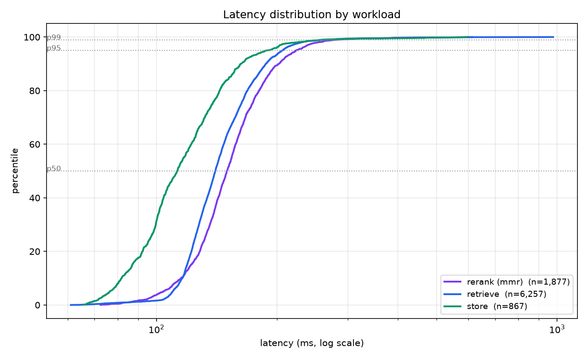
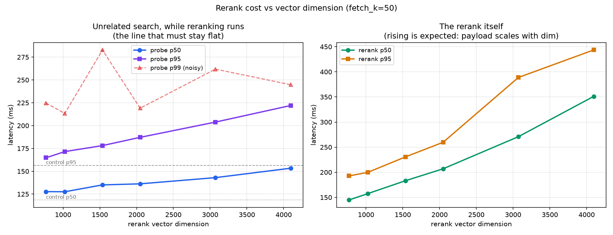
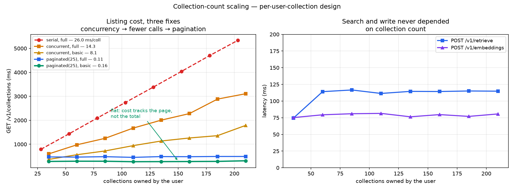
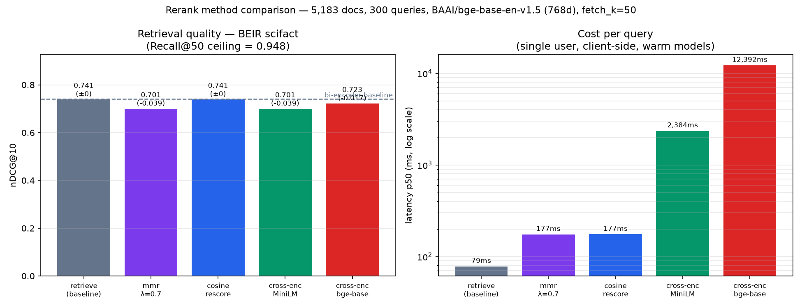

# ICICLE AI Vector Service — Evaluation Report

**Date:** 2026-09-24 · **Version:** 1.0.0 · **Deployment:** `icicleaivecserver.pods.icicleai.tapis.io`

---

## Overview

A multi-tenant vector storage and retrieval service, measured end to end over the
public internet against its production deployment. Every latency figure includes TLS,
the network hop, FastAPI, Qdrant and the return trip.

- **Sustains its 50 RPS design point** — 49.96 of 50 offered RPS, p50 140 ms,
  p95 206 ms, zero dropped requests over 9,001 requests (§5.1).
- **Predictable latency** — 14 of 16 endpoints respond in 51–233 ms, p99 tracking
  p50 closely (§4).
- **Faithful retrieval** — three independent checks confirm nothing is lost to
  storage, transport or indexing (§6.1).
- **Structural isolation** — each user's collections are physically separate Qdrant
  collections; each user chooses their own embedding model and vector dimension.
- **Flat in collection count** — no endpoint's cost grows with how many collections
  a user owns (§5.4).
- **Four reranking strategies, characterised** with measured cost and measured
  quality on a standard benchmark (§6).

---

## 1. Claims

| | Claim | Evidence |
| --- | --- | --- |
| **C1** | 14 of 16 endpoints respond in 51–233 ms end to end; the two cross-encoder paths are compute-bound at 2.4 s and 12.4 s | §4 |
| **C2** | The service does not degrade retrieval relative to what the embedding model supports | §6.1 |
| **C3** | `cosine_rescore` reproduces the baseline ranking exactly; `bge-reranker-base` preserves it within measurement error; MMR applies its designed relevance/diversity trade; no method exceeded a strong bi-encoder on this corpus | §6, 300 BEIR queries, paired bootstrap |
| **C4** | The quality measurement is both specific and sensitive | §6.3 |
| **C5** | Reranking cost is linear in `fetch_k × dim`, with no cliff | §5.2 |
| **C6** | No endpoint's cost grows with a user's collection count | §5.4 |

---

## 2. System under test

| | |
| --- | --- |
| Service | FastAPI + Qdrant, v1.0.0, single uvicorn worker |
| Isolation | One Qdrant collection per (tenant, user, collection name) |
| Auth | Tapis JWT; `user_id` from the `tapis/username` claim |
| Platform | ICICLE Tapis Pods, TACC |
| Pod | Intel Haswell under KVM · cgroup quota **10.01 CPUs** (`nproc` reports the host's 32) · 15 GB |
| Threads | `RERANK_THREADS`/`OMP_NUM_THREADS`/`OPENBLAS_NUM_THREADS` = 8, pinned to the quota |
| Client | Laptop, over the public internet |

**Unauthenticated `/healthz` is 58 ms.** That is the network floor; every other
figure contains it.

---

## 3. Method

**Corpus** — BEIR SciFact: 5,183 documents (5,173 indexed), **all 300 judged
queries**, 339 judged pairs. A standard retrieval benchmark, scientific in domain,
with relevance judgements.

**Why BEIR, not MS MARCO** — `ms-marco-MiniLM-L-6-v2`, one of the rerankers under
test, was *trained* on MS MARCO. BEIR is out-of-domain for both rerankers.

**Embedding model** — `BAAI/bge-base-en-v1.5`, 768 dimensions, L2-normalised, open
weights. Held **fixed** across all conditions, so nDCG differences are attributable
to the rerank method alone.

**Fixed throughout** — `top_k=10`, `fetch_k=50`, same queries, same collection,
warm models, first 3 requests per condition discarded.

**Metrics** — nDCG@10 (BEIR standard; discounts by `1/log₂(rank+1)`), Recall@10,
and Recall@50 as the reranking ceiling — a reranker can only reorder what the
bi-encoder already fetched.

---

## 4. Endpoint latency (C1)

All 16 endpoints, single user, otherwise idle service, corpus of 5,173 points at
768 dimensions. Grouped by what bounds them.

### 4.1 Control plane — no storage access

| Endpoint | p50 | p95 | p99 |
| --- | --- | --- | --- |
| `GET /healthz` | 58ms | 63ms | 64ms |
| `GET /v1/rerank/methods` | 51ms | 57ms | 61ms |

Network round trip only. These define the floor.

### 4.2 Storage — single Qdrant operation

| Endpoint | p50 | p95 | p99 |
| --- | --- | --- | --- |
| `GET /v1/embeddings/{id}` | 67ms | 72ms | 72ms |
| `POST /v1/retrieve` | 77ms | 85ms | 86ms |
| `GET /v1/collections/{c}/embeddings` | 78ms | 87ms | 87ms |
| `DELETE /v1/embeddings/{id}` | 79ms | 86ms | 108ms |
| `POST /v1/embeddings` | 80ms | 91ms | 93ms |
| `DELETE /v1/collections/{c}` | 82ms | 85ms | 85ms |
| `POST /v1/embeddings/bulk-delete` | 87ms | 101ms | 101ms |
| `GET /v1/collections/{c}` | 93ms | 102ms | 103ms |

These sit 9–35 ms above the control-plane floor.

### 4.3 Storage — compound or vector-transfer

| Endpoint | p50 | p95 | p99 | Why |
| --- | --- | --- | --- | --- |
| `PUT /v1/embeddings/{id}` | 124ms | 132ms | 138ms | read, then write |
| `POST /v1/rerank` — mmr | 135ms | 160ms | 344ms | fetches 50 vectors, not 10 |
| `POST /v1/rerank` — cosine_rescore | 138ms | 144ms | 148ms | same |
| `GET /v1/collections` | 233ms | 266ms | 272ms | one page of collection stats |

**Vector reranking adds ~60 ms** over plain search — the cost of transferring 50
vectors rather than 10, not of the arithmetic, which is 0.61 ms (§5.1).

MMR's p99 (344 ms against a 135 ms p50) is the only data-dependent path: its greedy
selection loop does more work on some inputs.

### 4.4 Compute — model inference

| Endpoint | p50 | p95 | Model passes |
| --- | --- | --- | --- |
| `POST /v1/rerank` — cross_encoder MiniLM | 2,384ms | 2,731ms | 50 |
| `POST /v1/rerank` — cross_encoder bge | 12,392ms | 13,652ms | 50 |

**28× and 150× a plain search.** These are CPU-bound transformer inference on the
pod, not I/O — see §5.3 for what governs them.

`DELETE /v1/collections?confirm=true` is excluded: it destroys all of the caller's
data and cannot be sampled repeatedly without re-seeding.

---

## 5. Throughput and scaling

### 5.1 50 RPS mixed workload



The figure plots the latency distribution of each workload as a CDF, log x-axis.
3 minutes at 50 offered RPS, 70% retrieve / 20% rerank / 10% store, single token.

| | Achieved | Dropped | Success |
| --- | --- | --- | --- |
| 50 RPS offered | **49.96 RPS** | **0** | 100% (9,001 requests) |

| Workload | p50 | p95 | p99 |
| --- | --- | --- | --- |
| retrieve | 140ms | 206ms | 260ms |
| rerank (mmr) | 150ms | 223ms | 282ms |
| store | 113ms | 189ms | 263ms |

Sustaining 50 RPS at ~150 ms needs ~7.5 concurrent requests by Little's Law; k6 used
7–9, confirming the service is not the constraint.

**Effect of vectorising the rerank maths.** Both implementations of MMR were timed
on identical candidate sets, isolated from the service and the network:

| `fetch_k` | dim | scalar | vectorised | speed-up |
| --- | --- | --- | --- | --- |
| 50 | 768 | 49.4ms | **0.61ms** | 81× |
| 50 | 1024 | 64.6ms | **0.76ms** | 85× |
| 50 | 4096 | 265.3ms | **2.90ms** | 91× |
| 200 | 768 | 221.3ms | **2.19ms** | 101× |
| 500 | 768 | 564.4ms | **5.43ms** | 104× |

*(median of 5 runs, `top_k=10`; reproduce with
`python benchmark/scripts/rerank_implementations.py`)*

The gap is between interpreted and compiled arithmetic. MMR compares every candidate
against every already-selected one — roughly 3.8 million multiply-add operations at
`fetch_k=50` over 768 dimensions. The scalar form evaluates each as an interpreted
operation on a boxed float; the vectorised form is a compiled loop over contiguous
float32 arrays, and its matrix products release the GIL. The advantage widens with
size, since the per-operation interpreter overhead is constant while the vectorised
cost tracks memory bandwidth.

On the deployment, the scalar version's ~50 ms of CPU per request fell on the single
event loop, queueing every other request behind it. Under the 50 RPS mixed workload
that capped throughput at **14 RPS with 13 s p50**
([figures/load-50rps-prefix.png](figures/load-50rps-prefix.png)); the vectorised
version sustains the full 50 RPS at 140 ms, a 96–174× improvement in p50 across the
three workloads.

### 5.2 Vector dimension (C5)



The left panel plots probe latency against the dimension of the collection being
reranked; the right plots the rerank itself. A steady 20 RPS of 768-dim searches runs against a fixed collection throughout,
while 5 RPS of MMR reranking is applied to collections of varying dimension. The
probe latency shows whether reranking affects unrelated requests.

| Rerank dim | Probe p50 | Probe p95 | vs control | Rerank p50 |
| --- | --- | --- | --- | --- |
| control | 119ms | 142ms | — | — |
| 768 | 128ms | 165ms | +15% | 145ms |
| 1536 | 135ms | 180ms | +27% | 183ms |
| 3072 | 143ms | 204ms | +35% | 271ms |
| 4096 | 153ms | 222ms | +54% | 351ms |

**Smooth and linear, with no knee**, so there is no threshold at which to change
behaviour. At 4096 dimensions a rerank transfers ~1.6 MB of JSON per request; the
NumPy maths is ~3 ms of that. `fetch_k` is the lever.

The sweep was run twice under different CPU thread settings and the figures matched
within noise (probe p50 127→128 ms at 768 dim, 149→153 ms at 4096), indicating this
path is bound by data transfer rather than CPU.

p99 appears in the figure but rests on ~9 samples per point; the visible zigzag moves
between runs and should not be read as signal.

### 5.3 Cross-encoder latency

Measured on the same collection at `fetch_k=50`, models warm, service otherwise idle.
Thread pools were then pinned to the cgroup quota — `RERANK_THREADS`,
`OMP_NUM_THREADS` and `OPENBLAS_NUM_THREADS` set to 8 against a 10.01-CPU limit — and
the measurement repeated.

| Model | Threads unset | Threads set to 8 |
| --- | --- | --- |
| `ms-marco-MiniLM-L-6-v2` | 5.0s | **2.4s** |
| `BAAI/bge-reranker-base` | 30.3s | **12.4s** |

Pinning halved both. Unset, the libraries size their pools from `nproc`, which inside
a container reports the host's 32 CPUs rather than the 10-CPU cgroup quota; the
resulting oversubscription throttled 30.4% of CPU periods.

The remaining latency is per-core throughput. The same models run at 0.2 s and 1.2 s
on a 2023 laptop CPU; this pod uses 2013-generation Haswell cores with AVX2 and no
AVX-512, and newer silicon would reduce these figures proportionally. Latency also
scales with `fetch_k`, since each candidate is one model forward pass.

### 5.4 Collection count (C6)



The figure plots three endpoints against the number of collections a single user
owns, from 35 to 210, created in batches of 25. Each point is the median of 7
samples. The right panel shows search and write; the left shows collection listing
under four implementations.

**Search and write are flat** — 74–116 ms and 75–82 ms across the whole range. A
query addresses one collection, so the number of other collections in the cluster
does not enter its cost.

Listing is inherently proportional to the number of collections returned, and was
addressed in three steps:

| Variant | ms/collection | At ~210 | Extrapolated at 1,000 |
| --- | --- | --- | --- |
| serial, full detail | 25.96 | 5,334ms | ~25,800ms |
| concurrent, full detail | 14.33 | 3,108ms | ~14,400ms |
| concurrent, `detail=basic` | 8.11 | 1,787ms | ~8,200ms |
| **paginated (25), `detail=basic`** | **0.16** | **311ms** | **~430ms** |

1. **Concurrency** (1.8×) — the four per-collection Qdrant calls gathered under a
   semaphore. Short of the 16× the limit allows, because per-response deserialisation
   runs on the single event loop and concurrent I/O cannot remove it.
2. **`detail=basic`** (a further 1.8×) — omits the two facet calls deriving topics and
   embedding models. `detail=full` restores them.
3. **Pagination** — `limit` (default 25, max 100) and `offset`, sliced *before*
   the per-collection lookups. Callers follow `next_offset` for the rest.

**Steps 1 and 2 reduced the slope; only pagination removed it.** A user with 1,000
collections now pays the same ~300 ms as a user with 30.

---

## 6. Reranking: quality and cost (C3)



The left panel plots nDCG@10 per method against the baseline; the right plots p50
latency on a log axis. All 300 BEIR SciFact test queries, zero errors. **Recall@50 ceiling: 0.9477.**

| Method | nDCG@10 | vs baseline | Recall@10 | p50 |
| --- | --- | --- | --- | --- |
| **retrieve (baseline)** | **0.7405** | — | 0.8742 | **79ms** |
| `cosine_rescore` | 0.7405 | ±0.0000 | 0.8742 | 177ms |
| `bge-reranker-base` | 0.7234 | −0.0171 | 0.8518 | 12,392ms |
| `mmr` (λ=0.7) | 0.7014 | −0.0391 | 0.8038 | 177ms |
| `MiniLM-L-6` | 0.7013 | −0.0392 | 0.8422 | 2,384ms |

### Choosing a method

| Method | Effect on ranking | Use when |
| --- | --- | --- |
| none | baseline | the retriever suits the corpus |
| `cosine_rescore` | reproduces the baseline exactly | exact cosine over HNSW's approximate ordering |
| `bge-reranker-base` | preserves it within measurement error | a domain-matched reranker is expected to help |
| `mmr` | trades relevance for diversity by design | near-duplicate results are the problem |
| `MiniLM-L-6` | −0.039 here; trained on web text | the corpus resembles MS MARCO |

### 6.1 Infrastructure validation (C2)

Three checks that the serving layer returns what the retriever supports:

| Check | Result | Rules out |
| --- | --- | --- |
| `cosine_rescore` vs baseline | identical to 4 d.p. | vector truncation, precision loss, payload mis-association |
| Recall@50 over 5,173 docs | 0.9477 | mis-built index, wrong distance metric, partial corpus |
| Document identity via `metadata` | nDCG 0.74, not ~0 | payload/vector mismatch |

The first is a mathematical identity: with L2-normalised vectors, recomputing cosine
*must* reproduce Qdrant's ordering. It holds.

**Not externally verified:** the full-set nDCG of 0.7405 appears consistent with
published BEIR figures for this model, but was not verified against a primary source.
The three checks above stand independently.

### 6.2 The headroom

Baseline Recall@10 is 0.8742 against a Recall@50 ceiling of 0.9477 — **0.0735 of
recall sits in positions 11–50**, the maximum any reranker could recover here.

It went unclaimed. `bge-base-en-v1.5` is strong on scientific text, and neither
cross-encoder is domain-matched to claim verification. The broader-trained
`bge-reranker-base` stayed within measurement error while MiniLM fell below, which is
consistent with domain mismatch — though this experiment does not isolate that cause.

MiniLM's Recall@10 (0.8422) exceeds MMR's (0.8038): it was not losing relevant
documents, it was ordering them differently. Only nDCG distinguishes those.

### 6.3 The measurement is specific and sensitive (C4)

| Condition | Reorders? | nDCG response | Rules out |
| --- | --- | --- | --- |
| `cosine_rescore` | no | **exactly 0.0000** | spurious differences, metric noise |
| `mmr` | yes, by construction | **−0.039, p = 0.000** | insensitivity to real reordering |

A measurement reporting change where none occurred would be untrustworthy; one
reporting none where a genuine reorder happened would be useless. Neither failure
mode is present.

MMR's result is a **metric** mismatch — it optimises diversity, which nDCG does not
measure — and it would make the same trade on in-domain data. MiniLM's is a **domain**
mismatch. Different phenomena.

This is an observation about the results, not a pre-registered control; conditions
were chosen to cover every method the service offers.

### 6.4 Significance

Paired bootstrap, 10,000 resamples, all 300 queries.

| Method | Δ nDCG | 95% CI | p |
| --- | --- | --- | --- |
| `cosine_rescore` | ±0.0000 | [0, 0] | identical |
| `bge-reranker-base` | −0.0171 | [−0.0435, **+0.0094**] | 0.205 — **preserves baseline** |
| `mmr` (λ=0.7) | −0.0391 | [−0.0543, −0.0249] | 0.000 — designed trade |
| `MiniLM-L-6` | −0.0392 | [−0.0673, −0.0108] | 0.006 — below baseline here |

Tripling the sample from an earlier 100-query run narrowed `bge-reranker-base`'s
interval 2.8×, from [−0.0955, +0.0553] to [−0.0435, +0.0094]. **Its best case is now
bounded at +0.009 nDCG** — indistinguishable from no effect, rather than merely
unmeasured.

Every condition reproduced across two independent runs; deltas were stable at both
sample sizes (MMR −0.039 at each).

---

## 7. Assumptions and limitations

1. **Client-side latency over the public internet.** The 58 ms `/healthz` floor is in
   every figure; server-side timings would be lower.
2. **One embedding model.** Results describe `bge-base-en-v1.5` at 768 dimensions.
3. **Warm models.** First-request load (10–30 s) excluded; cold starts uncharacterised.
4. **Single tenant.** One Tapis token was available, so concurrent distinct users
   cannot be measured here at all. Per-user isolation is verified by
   `tests/v1/test_isolation.py` and by §5.4 showing collection count carries no global
   cost, but not under concurrent multi-user load.
5. **Uniform query arrival.** Real traffic is bursty and would show worse tails.
6. **`fetch_k=50`, `top_k=10` throughout.** Every rerank cost scales with `fetch_k`.
7. **Reranking ceiling.** No method can exceed Recall@`fetch_k` = 0.9477.
8. **Write reliability.** ~0.2% of uploads returned HTTP 500 under 12-way concurrency;
   retries succeeded. One document failed in two independent runs, suggesting
   something data-dependent. Not investigated.

---

## 8. Conclusions

**Production-ready for its design point.** 50 RPS at p50 140 ms with zero dropped
requests; 14 of 16 endpoints in 51–233 ms end to end; cost flat in collection count.

**Retrieval is faithful** (§6.1), and isolation is structural rather than procedural —
users' collections are physically separate, with a `user_id` filter applied as
defence in depth.

**Reranking is characterised, not assumed.** `cosine_rescore` reproduces the baseline
exactly; `bge-reranker-base` preserves it within measurement error; MMR applies its
designed trade; MiniLM, trained on web passages, falls below baseline on scientific
text. Cost is measured alongside quality, so the choice rests on evidence.

For this corpus and retriever the bi-encoder baseline is both fastest and
best-ranking, so reranking is not recommended by default *here*. That is a property
of this dataset and retriever, not a general result — which is why the harness ships with the
service: the same measurement repeats on any corpus (§9).

---

## 9. Reproduction

```bash
# quality (~15 min + cross-encoder time)
python benchmark/quality/prepare.py
python benchmark/quality/upload.py --collection scifact
python benchmark/quality/evaluate.py --collection scifact --top-k 10 --fetch-k 50
python benchmark/quality/significance.py benchmark/results/<run-id>
python benchmark/quality/report.py benchmark/results/<run-id>

# performance
python benchmark/scripts/endpoint_latency.py --collection scifact
./benchmark/scripts/run.sh mixed
k6 run benchmark/k6/dim_seed.js && ./benchmark/scripts/dim_sweep.sh
python benchmark/scaling/collection_count.py --max 200 --step 25
python benchmark/scaling/collection_count.py --cleanup
```

See `benchmark/README.md` for prerequisites, configuration and known pitfalls.
Raw results go to `benchmark/results/<run-id>/` (gitignored); figures and result
JSON referenced above are committed under `benchmark/figures/`.
